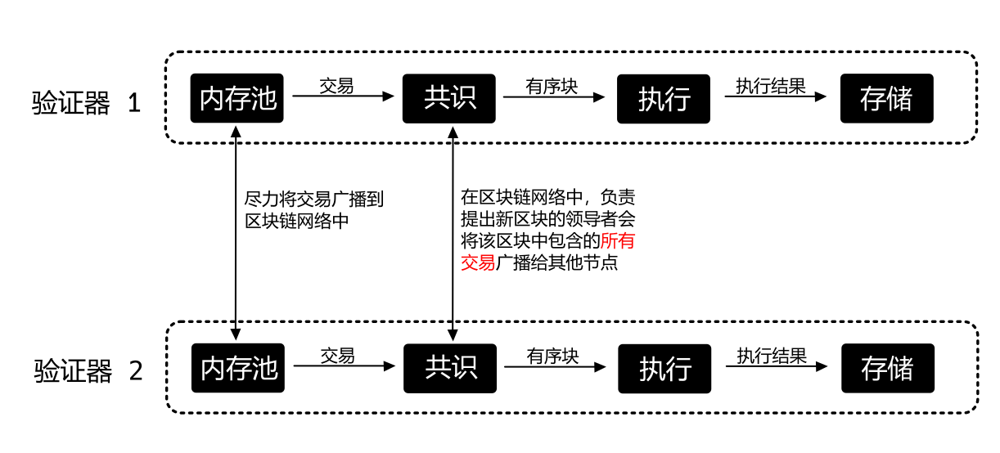
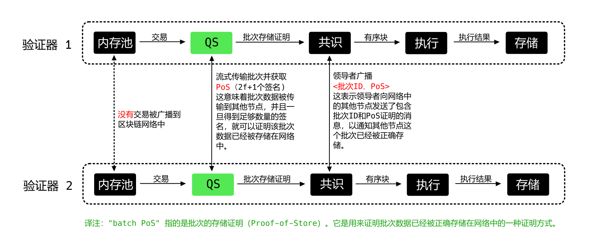

[TOC]

# AIP-26 - Quorum Store

## 一、概述

Quorum Store 是对 Narwhal [^1]的生产优化实现，它提高了共识吞吐量。Quorum Store已在 previewnet 中进行了测试，这是一个类似主网的 100 多个节点网络，在此网络中，它将 TPS 提高了 3 倍。它将消除共识为吞吐量瓶颈的主要问题。它具有广泛的表区域，改变了验证者如何传播（disseminate）、排序（order）和执行交易（execute transcation）的细节。

## 二、动机

Quorum Store提高了主网和地理上分散的类似主网的网络中的共识TPS。基于领导者的共识TPS受限于一个回合中单个提议者发送数据并从Quorum接收投票所需的时间；分散式网络需要需要花费100+毫秒的往返时间的投票。Quorum Store通过同时传播数据在这种环境中表现良好。

Quorum Store 通过在主网和类似主网的地理上分散的网络中提高共识 TPS 来改善共识吞吐量。基于领导者的共识 TPS 受限于一轮中单个提议者发送数据和从 Quorum 接收投票所需的时间；分散的网络需要`100+` 毫秒的往返时间来获取投票。Quorum Store 通过并发地分发数据，它在这种环境中表现很好。

## 三、基本原理

Quorum Store基于 Narwhal，这是一种经过同行评审并获得肯定的方法，用于在基于领导者的拜占庭容错（BFT）共识中实现更高的吞吐量。我们的测试显示了显著的吞吐量改善：在 previewnet，一个类似主网的100+节点网络中，吞吐量提高了 3 倍，而在 3 区域模拟设置中，纯共识基准测试显示吞吐量提高了 12 倍。

Quorum Store 不需要对现有的经过充分研究和实战测试的 Aptos 组件进行根本性改变——例如，BFT共识（也称为 Jolteon [^2]）、内存池和流水线执行。因此，我们预计其部署和操作将相对简单，尽管在下面的“风险和缺点”中强调了以下风险。

## 四、规范

### 1. 现有的区块链架构

在下面的图中，我们首先展示了 Aptos 主网验证器的现有架构，从交易分发到提交。该架构由一系列组件组成。我们将重点关注共识组件（内存池 + 共识）。

- **内存池（Mempool）**阶段接收来自全节点的交易，并尽力广播所有交易以与其他验证者同步。内存池为共识提供了一个API，以便从内存池中拉取交易。
- **共识**（AptosBFT / [Jolteon](https://arxiv.org/abs/2106.10362)，Hotstuff 的延迟优化版本）阶段按轮次进行，每一轮 `r` 选出**一个领导者来向所有节点提议一个交易块**。所有节点对块（block）进行投票（vote），将被投的票（votes）发送给下一轮的领导者，并在收到足够的票后，下一轮的领导者提出新的轮次，依此类推。
  更具体地说，非领导者节点通过签署块元数据来对提议的块进行投票，并将他们的投票发送给下一轮的领导者。下一轮的领导者收集 `2f+1` 个投票/签名来形成轮次 `r` 的块的法定人数证书（QC， quorum certificate），并带着 QC 向所有节点提出新的轮次 `r+1` 的块。所有节点进行投票并发送给下一轮的领导者，依此类推。当某个块满足提交规则时，验证者可以提交该块，提交规则指出两个认证块（带有 QCs 的块）中的第一个块可以被提交，这两个块具有连续的轮次编号。
- **执行**阶段通过 BlockSTM 有序地执行块，并输出执行结果。验证者对他们的执行结果进行签名并交换，一旦 `2f+1` 个验证者签署了某个执行结果，就认为该执行结果有效。
- **Store**阶段将最终有效的执行结果及其相应的证明持久化Store。

### 2. 现有架构中的瓶颈

- **领导者广播中的瓶颈。** 在 Jolteon 中的领导者向所有节点广播所有交易，而非领导者只发送小消息，如投票。事实上，系统的吞吐量受到领导者带宽的限制，与此同时，其他所有节点的带宽被浪费。此外，由于领导者广播瓶颈，共识的延迟相对较高。
- **交易传播中的重复。** 在内存池 (mempool) 进行的全力广播过程中，一笔交易会被发送至所有节点。根据 Jolteon 协议，当领导者节点广播其提案区块时，这笔交易将再一次对所有节点进行广播。如此在交易传播上的重复操作，导致了系统带宽的低效使用。

### 3. 使用QuorumStore的架构

Quorum Store（QS）通过以下方式解决了上述瓶颈问题：（1）将数据传播与排序分离，（2）使交易批量广播可证明，并且（3）共识轻量化。

以下，我们详细解释了带有 Quorum Store 的架构。

- 内存池层的广播被移除，因为 QS 将以可证明的方式执行广播。
- 在现有（本地）内存池和共识之间添加了QS层，该层不断地从内存池中拉取交易，形成一个批次，并将批次流式传输到所有其他节点。当一个节点从其他节点接收到一个完整的批次时，它会对批次元数据进行签名，并将签名返回给批次创建者。当批次创建者收到批次 `id` 上收到 `2f+1` 个签名时，它形成 Store 证明（PoS）。**批次 id 的 PoS 存在，保证了相应批次的唯一性和可用性**（[为什么？](https://decentralizedthoughts.github.io/2022-09-10-provable-broadcast/)）。请注意，所有节点都在并发地广播交易批次，并通过 PoS 获得批次认证。因此，**系统的带宽利用率可以最大化**，与当前架构相比，其中领导者达到其带宽限制，而其他节点的网络工作量较小。
- 共识层保持不变，但是**领导者现在从 QS 层中拉取经过认证的批次，并且在所提出的区块中仅包含相应的批次元数据（批次id等）及其对应的PoS（而不是原始交易）**。共识将同意块的顺序，因此也就确定了交易的顺序，因为块中的每个经过认证的批次都唯一地对应于一个有序的交易列表。
- 在一般情况下，所有验证者应该拥有所有批次的交易，但是如果一个验证者在排序时没有一个批次（这可能是由于网络延迟造成的），它将从其他节点预取批次（基于相应的 PoS 中的签名）。

## 五、参考实现

一个实现在主分支中已经完成。它通过链上配置进行控制，因此在执行网络上的治理提案之前不会生效。其中一些关键的PR（Pull Request）包括：

- [https://github.com/aptos-labs/aptos-core/pull/5464](https://github.com/aptos-labs/aptos-core/pull/5464)
- [https://github.com/aptos-labs/aptos-core/pull/5400](https://github.com/aptos-labs/aptos-core/pull/5400)
  - [https://github.com/aptos-labs/aptos-core/pull/5779](https://github.com/aptos-labs/aptos-core/pull/5779)

- [https://github.com/aptos-labs/aptos-core/pull/5613](https://github.com/aptos-labs/aptos-core/pull/5613)
- [https://github.com/aptos-labs/aptos-core/pull/6055](https://github.com/aptos-labs/aptos-core/pull/6055)
- [https://github.com/aptos-labs/aptos-core/pull/6710](https://github.com/aptos-labs/aptos-core/pull/6710)
- [https://github.com/aptos-labs/aptos-core/pull/6785](https://github.com/aptos-labs/aptos-core/pull/6785)
- [https://github.com/aptos-labs/aptos-core/pull/7045](https://github.com/aptos-labs/aptos-core/pull/7045)
- [https://github.com/aptos-labs/aptos-core/pull/7114](https://github.com/aptos-labs/aptos-core/pull/7114)
- [https://github.com/aptos-labs/aptos-core/pull/7194](https://github.com/aptos-labs/aptos-core/pull/7194)
- [https://github.com/aptos-labs/aptos-core/pull/7190](https://github.com/aptos-labs/aptos-core/pull/7190)
- [https://github.com/aptos-labs/aptos-core/pull/7639](https://github.com/aptos-labs/aptos-core/pull/7639)
- [https://github.com/aptos-labs/aptos-core/pull/7315](https://github.com/aptos-labs/aptos-core/pull/7315)

## 六、风险和缺点

- **风险1：系统行为的变化。** 虽然 QuorumStore 并不从根本上改变现有的内存池（mempool）、共识（consensus）和执行（execution）组件，但有许多微妙的交互可能会改变行为。比如，我们投入了时间来优化配置设置，目的是让交易费市场能够更有效率地运作。

- **风险2：代码层面（Code surface）。** 这需要严格的测试，我们通过单元测试、冒烟测试、锻造测试以及在 previewnet 中的压力测试来完成。在在主网中启用链上配置之前，它还将在开发网和测试网中启用。
- **风险3：验证者激励。** Quorum Store 需要验证者进行大量工作，这与提出区块是分开的。为了适当地激励这项工作，我们计划分配相当一部分交易费用来奖励在Quorum Store上完成的工作。我们不认为这目前是启用Quorum Store的障碍。关于计划中的验证者激励的更多细节将在未来的AIP中添加。
- **缺点1：低负载时的延迟。**与内存池广播相比，Quorum Store引入了额外的往返时间；这是在最佳情况下延迟的增加，例如，在低负载时约为250毫秒。请注意，在高负载下，Quorum Store提供的吞吐量增加由于排队时间显著减少了延迟。

## 七、未来潜力

Quorum Store是下一代共识改进的起点。 

- 通过将专用的 Quorum Store 节点作为逻辑验证者的一部分添加，Quorum Store 可以被增强以支持验证者内部的水平扩展。这一点在 Narwhal 中已经探讨过了。
- Quorum Store 是迈向基于 DAG 的共识（如 Tusk [^1]和 Bullshark [^3]中所探讨的）以及一般基于 DAG 的协议的跳板。

## 八、建议的实施时间表

- 里程碑1（已完成）：完成具有单元测试和端到端测试的代码
- 里程碑2（已完成）：在 previewnet 中进行性能验证和迭代
- 里程碑3（进行中）：内部安全审计

## 九、建议的部署时间表

- 里程碑1（计划中）：分割为发布v1.4
- 里程碑2（计划中）：在开发网中进行链上配置更改
- 里程碑3（计划中）：在测试网中进行链上配置更改
- 里程碑4（计划中）：通过治理提案在主网中进行链上配置更改

## 十、参考资料

[^1]: Narwhal和Tusk：基于 DAG 的内存池和高效的 BFT 共识 [https://arxiv.org/abs/2105.11827](https://arxiv.org/abs/2105.11827)

[^2]: Jolteon和Ditto：具有异步回退的网络自适应高效共识 [https://arxiv.org/abs/2106.10362](https://arxiv.org/abs/2106.10362)
[^3]: Bullshark：DAG BFT 协议的实用性 [https://arxiv.org/abs/2201.05677](https://arxiv.org/abs/2201.05677)

