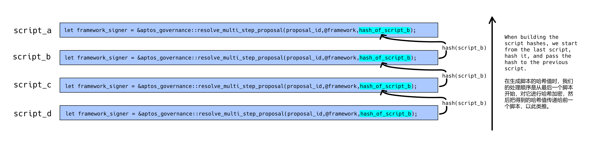
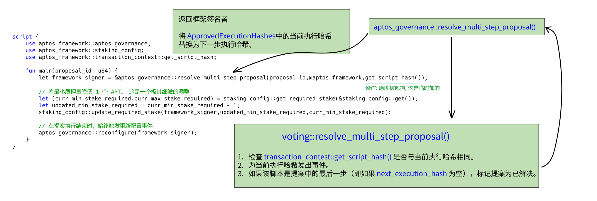

[TOC]

# AIP-3 - 多步骤治理提案

## 一、概述

Aptos 链上治理是指 Aptos 社区可以通过提出、投票和解决提案的方式来管理 Aptos 区块链的运营和发展的过程。

目前，链上的每一个提案只能包含一个脚本。由于 MoveVM 会在脚本执行完毕后才对虚拟机（VM）施加更改，因此我们无法在同一个脚本内实施相互依赖的更改。这就导致我们在进行系统升级时，经常需用到多个脚本才能完成整个流程。

当我们进行包含多个脚本的升级时，我们需要逐一提交多个单独的提案，由投票者对每个提案分别投票，并分别手动处理每个提案。为了简化这一过程，我们计划支持提交包含多步操作的提案——在这样的提案中，可以包括多个脚本，一旦提案获得通过，这些脚本将会按照既定的顺序依次执行。

## 二、动机

通过多步骤提案，我们将能够创建一个包含多个步骤的链上提案，社区成员将对这个综合提案进行投票。一旦投票通过，系统将一次性依次执行所有的脚本。这样不仅可以减轻社区成员的工作负担，还能确保这些脚本严格按照既定顺序执行。

## 三、考虑的替代方案

**替代方案一：保持现状**

现阶段，使用单个脚本的单步提案方式来推进一次含有多个脚本的升级，不仅耗时而且需要手动操作，而且如果脚本只执行了一部分，极易出错。我们认为，引入支持多步骤提案的机制会是一个更好的选择。这不仅能为提案者、投票者以及提案解决者节省宝贵时间，还能保证所有步骤都能按照正确的顺序执行。

**替代方案二：对 MoveVM 进行更改**

由于 MoveVM 在脚本的末尾应用所有更改，当一些更改依赖于同一脚本中的其他更改时，我们无法在单个脚本中包含所有升级。

我们可以考虑进行虚拟机（VM）层面的修改，在每笔交易完成时对虚拟机进行相应的更新，这样就能够在一次操作中执行完所有升级。但是，这种做法将引起较为广泛的系统变动，不仅开发周期可能超过数月，而且会影响系统的多个部分。相对而言，我们觉得直接对智能合约进行改动更为简便，因为它在本质上达到了相同的目的，并且比对虚拟机层面的大规模修改要简单得多。

## 四、规范

为了实现多步骤提案的功能，我们提出了“脚本链（a chain of scripts）”的概念。投票者只需对该脚本链的第一个脚本进行一次全面性的投票，即投赞成或反对，决定是否接受整个脚本链的执行。系统不支持对脚本链的部分脚本进行分开投票。

比如说，我们有一个包含脚本 `script_a`、`script_b`、`script_c` 和 `script_d` 的多步骤提案。用户只需对第一个脚本 `script_a` 进行投票。一旦用户对 `script_a` 投了赞成票，就等同于对整个脚本链 `script_a`、`script_b`、`script_c` 和 `script_d` 的执行表示了支持和认可。

一旦多步骤提案获得通过，我们将利用命令行界面（CLI）来按顺序执行脚本链中的每一个脚本。

**脚本链**

在制作执行的脚本时，我们从序列中的最后一个脚本（假设它是第 `x` 个提案）入手，先对它进行哈希处理，然后把这个哈希值传给第 `x-1` 个提案。虽然上链的提案只会展示链中的第一个脚本，但通过在该脚本中嵌入哈希，这确保了整个脚本链的内容与执行顺序的完整性。我们会提供命令行工具来帮助创建这样的脚本链，并且确认每个脚本都存在并按照正确的顺序排列。

**创建和投票多步提案**

创建和投票提案的流程基本保持不变：

- 创建提案时，提议者只需在 `execution_hash` 参数中传递第一个脚本。
- 当投票对某个提案表决时，对链中第一个脚本投赞成还是反对票，就代表了投票者对整个脚本执行序列的批准或拒绝。

**解决多步提案**

在我们提议的多步提案设计中，解决多步提案时：

- `aptos_governance::resolve_multi_step_proposal()` 返回一个签名者，并用下一个脚本的哈希替换当前的执行哈希。
- `voting::resolve()` 检查当前脚本的哈希是否与提案的当前执行哈希相同，更新链上的 `proposal.execution_hash` 为 `next_execution_hash`，并为当前执行哈希发出事件。
- `voting::resolve()` 如果当前脚本是脚本链中的最后一个脚本，则标记提案已解决。

**安全性**

- 智能合约安全与审计

为确保代码及其操作的安全性和准确性，这一实施过程将接受知名第三方审计公司的严格安全审核。

- 验证

我们主要关注两种验证：

1. 验证所有脚本是否存在；
2. 验证按顺序逐个执行它们是否能够正常工作（链式结构和重放是否良好）。

为了进行前述的验证工作，我们将提供命令行界面（CLI）工具的支持。

- 去中心化与治理

此提案调整了提案内容所包含的结构，即由多个脚本组成而非单一脚本，但这不会改变链上治理的权限范围。同时，这一变更也不会影响系统的去中心化特征或者治理能力。

**工具支持**

我们即将在命令行工具（CLI）和用户治理界面（governance UI）上新增功能支持，以便用户可以更方便地创建、投票并执行那些包含多个步骤的提案。

## 五、参考实施

建议的变更PR：

[https://github.com/aptos-labs/aptos-core/pull/5445](https://github.com/aptos-labs/aptos-core/pull/5445)

## 六、风险与缺点

去中心化 - 没有影响或变化。

安全性 - 增加的治理代码将经过严格的测试和审计。

工具支持——当前的命令行界面（CLI）仅支持 Aptos 的治理功能，然而这套多步骤的机制亦可适用于其他通用的自治组织（DAO）和治理场景。Aptos 团队与社区计划在近期内对 CLI 及工具进行升级，以增强它们的通用性。

## 七、初步实施时间表

11/07 - 11/22

- 发布AIP草案，征求社区反馈。
- 对多步提案设计进行设计审查和初步安全审查。

11/22 - 11/30
- 正式确定AIP
- 完善草案 PR，添加单元测试，并将 PR 合并。
- 在 Devnet 上部署 Move 更改。

11/30 - 12/14
- 添加 CLI 支持。
- 运行测试。
- 在 Testnet 上部署 Move 更改。

12/15 - 12/20
- 端到端测试。
- 可能在 Mainnet 上部署 Move 更改。