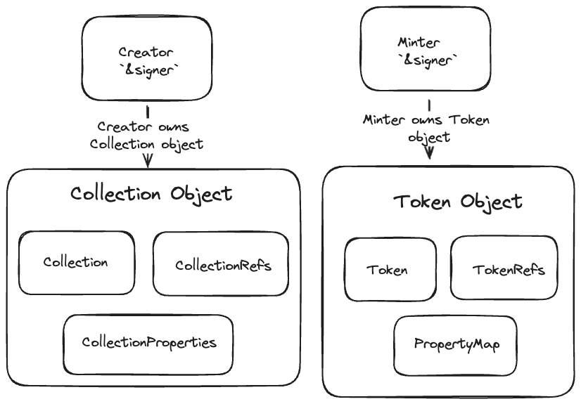

[TOC]

# AIP-72 - 数字资产铸币标准

## 一、摘要

该AIP的重点是介绍一个用于创建 Collection 和 Token 的非框架标准。目前存在一个简单、不可扩展的无代码 Token 解决方案`aptos_token`。它提供了创建 Token 和 Collection 的基本用例，但没有对如何执行这些操作进行定义（customizations），例如白名单、具有动态类型的 coin 支付。该 AIP 的几个亮点包括：

1. 使用对象（object）创建 collection 并管理铸造（mint）。
2. 通用标准，使得它易于被索引。
3. 采用模块化方法，其中每个模块，包括铸造函数（mint functions），都是完全独立的，可以在自定义模块中与其他模块一起使用。


## 二、动机

我们旨在提供一个非框架标准，以展示执行复杂操作的“正确”方法。以下是一些示例：

- 使用最少的运营开销，以正确有效地管理白名单。
- 一个专注于开发人员或用户意图的引用管理框架，而不是引用的能力
    - 一个可能出错的场景是当`Refs`没有为 collection / token 正确配置或存储时。配置不当可能导致对collection 和 token 失去控制。我们希望提供开发者可以使用的行业标准代码，同时不必担心如何正确配置。
- 作为标准，索引需要被构建一次，并且可以轻松地在该库的扩展中重复使用。
- 提高代码的可重用性。
  - **[示例](https://github.com/aptos-labs/token-minter/blob/main/launchpad/sources/launchpad.move#L126)**，我们在不到50行的代码中构建了一个自定义铸造！（相同的操作至少需要300行以上）


## 三、规范

NFT 铸造者创建了一个核心铸造合约，该合约由 NFT 铸造标准库中的模块选择组成。这种做法允许铸造者编写一个包含大约 100 行代码或更少的单一文件铸造包，因为可以重用广泛的铸造模块库。这些模块包括 `token_refs`、`collection_refs`、`transfer_token`、`coin_payment`、`collection_properties`。

这个标准不会成为框架的一部分，以便我们能够快速迭代并更灵活地扩展它。为了消除安全风险，我们决定使模块**不可升级**，并将这些模块部署在资源账户上，并删除对签名者能力的访问权限。（**我们无法访问私钥**）。

此外，合约将被不可变地部署，这意味着一旦部署就不能升级。这样做是为了消除所有与可升级合约相关的风险，如法律、密钥管理等。我们选择的模块化方法意味着我们可以持续发布新的模块或现有模块的升级，但同时在链上保留所有版本的不同模块名称和不同的包。选择使用哪些模块的好处是，这为开发者提供了完全控制整个应用程序设计方式的能力。


### 1. 核心逻辑



### 2. Collections


在创建 collection 时，传递给模块创建 collection 函数的签名者将成为所有者。**开发者决定这个所有者。**创建者直接拥有 collection object ，给予开发者灵活性，可以创建自定义 object 或账户来处理 token 的铸造、所有权和 collection 的管理。

1. `CollectionComponents` 模块负责创建集合引用和属性。开发人员将有一个要传入的配置，根据此配置将生成引用。这包括允许转移token 、销毁 token 、更改 collection 和 token 描述。
2. 只要引用是从集合属性配置中存储的，该模块将包含所有用于变更 collection 的入口函数。
3. `CreateCollectionRefs` 和 `CreateCollectionProperties` 事件在集合创建后被发出。我们对这些事件进行索引，为开发人员创建激励，因为他们受益于索引事件。


```move
#[resource_group_member(group = aptos_framework::object::ObjectGroup)]
/// 集合引用的结构体，具有关键字。
struct CollectionRefs has key {
    /// 用于改变集合字段的 mutator 引用。
    mutator_ref: Option<collection::MutatorRef>,
    /// 用于改变版税的 mutator 引用。
    royalty_mutator_ref: Option<royalty::MutatorRef>,
    /// 生成签名者所需的扩展对象引用，将来可能需要扩展对象。
    extend_ref: Option<object::ExtendRef>,
}

#[event]
/// 创建 CollectionRefs 时发出的事件。
struct CreateCollectionRefs has drop, store {
    mutator_ref_exists: bool,
    royalty_mutator_ref_exists: bool,
    extend_ref_exists: bool,
}

#[event]
/// 创建 CollectionProperties 时发出的事件。
struct InitCollectionProperties has drop, store {
    mutable_description: bool,
    mutable_uri: bool,
    mutable_token_description: bool,
    mutable_token_name: bool,
    mutable_token_properties: bool,
    mutable_token_uri: bool,
    mutable_royalty: bool,
    tokens_burnable_by_creator: bool,
    tokens_transferable_by_creator: bool,
}
    
#[resource_group_member(group = aptos_framework::object::ObjectGroup)]
/// 集合属性的结构体，具有关键字。
struct CollectionProperties has key {
    /// 确定创建者是否可以更改集合的描述。
    mutable_description: bool,
    /// 确定创建者是否可以更改集合的 URI。
    mutable_uri: bool,
    /// 确定创建者是否可以更改 token 描述。
    mutable_token_description: bool,
    /// 确定创建者是否可以更改 token 名称。
    mutable_token_name: bool,
    /// 确定创建者是否可以更改 token 属性。
    mutable_token_properties: bool,
    /// 确定创建者是否可以更改 token URI。
    mutable_token_uri: bool,
    /// 确定创建者是否可以更改版税。
    mutable_royalty: bool,
    /// 确定创建者是否可以销毁 token。
    tokens_burnable_by_creator: bool,
    /// 确定创建者是否可以转让 token 。
    tokens_transferable_by_creator: bool,
}

/// 在单个集合对象中创建 `Collection`、`CollectionRefs`、`CollectionProperties` 资源。
/// 发出 `CreateCollectionEvent`。
public fun create_collection(
    creator: &signer,
    description: String,
    max_supply: Option<u64>, // 如果值存在，则集合配置为具有固定供应量。
    name: String,
    uri: String,
    mutable_description: bool,
    mutable_royalty: bool,
    mutable_uri: bool,
    mutable_token_description: bool,
    mutable_token_name: bool,
    mutable_token_properties: bool,
    mutable_token_uri: bool,
    tokens_burnable_by_creator: bool,
    tokens_transferable_by_creator: bool,
    royalty: Option<Royalty>,
): Object<Collection> {}
```


### 3. Tokens

token 模块将提供更新/改变 token 属性映射的功能。 `property_map.move` 将通过一个函数来更新带有 `ExtendRef` 的 token 的属性映射。目前还没有支持此操作的函数，仅在构造 token 时使用 `ConstructorRef`。

1. `TokenComponents` 模块负责创建与最初为 collection 配置的属性相关联的 token 引用。
2. 只要引用是从 collection 属性配置中存储的，则此模块将包含所有用于改变 token 的入口函数。
3. 创建 token 引用时会发出 `CreateTokenRefs` 事件，并对这些事件进行索引。

```move
#[resource_group_member(group = aptos_framework::object::ObjectGroup)]
struct TokenRefs has key {
    /// 用于生成 token 的签名者。可用于扩展 token 或从 token 中转出对象。
    extend_ref: object::ExtendRef,
    /// 用于销毁。
    burn_ref: Option<token::BurnRef>,
    /// 用于控制冻结。
    transfer_ref: Option<object::TransferRef>,
    /// 用于改变字段。
    mutator_ref: Option<token::MutatorRef>,
    /// 用于改变属性。
    property_mutator_ref: property_map::MutatorRef,
}

#[event]
struct CreateTokenRefs has drop, store {
    extend_ref_exists: bool,
    burn_ref_exists: bool,
    transfer_ref_exists: bool,
    mutator_ref_exists: bool,
    property_mutator_ref_exists: bool,
}

public fun create(
    creator: &signer,
    collection: Object<Collection>,
    description: String,
    name: String,
    uri: String,
    recipient_addr: address,
    soulbound: bool,
): Object<Token> {}
```

### 4. 附加功能扩展

例如，CoinPayment 是一个模块，用于创建充当费用的对象。例如，这可用于创建铸造费用（minting fees）、启动平台费用（launchpad fees）。

1. 这用于创建 `CoinPayment<T>` 资源，其中 `T` 表示要用于支付的 coin 类型。这是一个用户可以选择使用或不使用的模块。其目标是简化费用生成。
2. 一旦支付执行，`CoinPaymentEvent` 将被发出，并对这些事件进行索引。这特别有用，因为它会发出与每次交易相关的所有费用，开发者可以用于审计目的。

```move
struct CoinPayment<phantom T> has copy, drop, store {
    /// 要支付的 coin 数量。
    amount: u64,
    /// 要支付 coin 的地址。
    destination: address,
    /// 此支付的类别，例如铸币费用、发射台费用。
    category: String,
}

#[event]
/// 当类型为 `T` 的 coin 支付时发出的事件。
struct CoinPaymentEvent<phantom T> has drop, store {
    from: address,
    amount: u64,
    destination: address,
    category: String,
}


public fun create<T>(amount: u64, destination: address, category: String): CoinPayment<T> {
    assert!(amount > 0, error::invalid_argument(EINVALID_AMOUNT));
    CoinPayment<T> { amount, destination, category }
}


public fun execute<T>(minter: &signer, coin_payment: &CoinPayment<T>) {
    let amount = amount(coin_payment);
    let from = signer::address_of(minter);
    assert!(
        coin::balance<T>(from) >= amount,
        error::invalid_state(EINSUFFICIENT_BALANCE),
    );

    let destination = destination(coin_payment);
    coin::transfer<T>(minter, destination, amount);

    event::emit(CoinPaymentEvent<T> {
        from,
        amount,
        destination,
        category: category(coin_payment),
    });
}
```


## 四、风险与缺陷

我们计划使用资源账户将这些合约作为不可变合约部署。不会存储签名者能力，这意味着与部署的合约没有关联的密钥。因此，不同时间部署的模块可以独立进行，并且可以在不同的地址上部署。当创建新模块时，它们将在每次部署时部署到一个独特的资源账户。

 如果我们的模块中存在错误，并且项目正在使用它们，它们将容易受到这些错误的影响。这些模块是不可升级的，我们需要创建一个包含错误被修复的新模块，然后部署到一个新的地址。这不需要通过治理提案，因此修复可以更快地部署到主网。


### 1. 参考实现

**[启动平台示例](https://github.com/aptos-labs/token-minter/blob/main/launchpad/sources/launchpad.move)**

### 2. 未来展望

在建立这一标准的过程中，我们意识到还有其他需要考虑的因素，比如定义半同质 token（SFT）标准，因为目前在 Aptos 中还没有标准。目前，Aptos 的示例 SFT 是属于一个 collection 的 token，但它还具有可分割为资产并作为可分割资产转移的可分割存储的特性。从概念上讲，它是具有额外链上元数据的可分割资产。