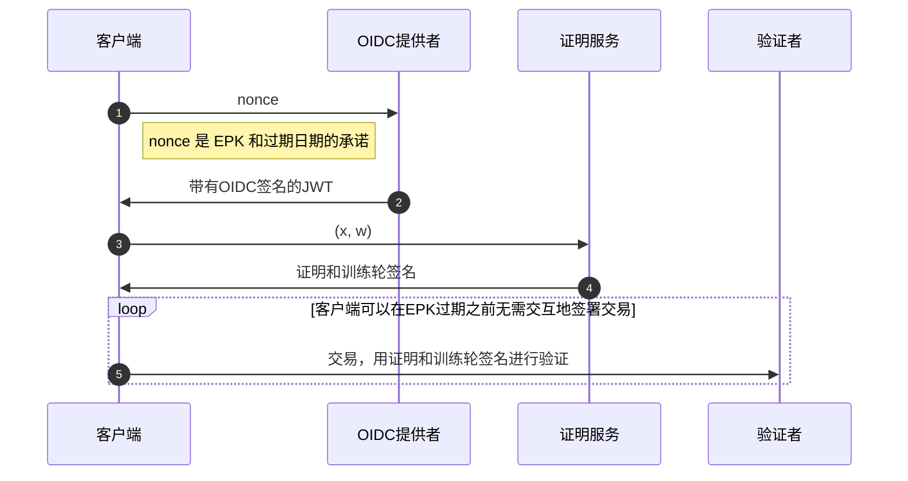

[TOC]

# AIP-75 - 无密钥账户的证明服务

## 一、摘要

本AIP是[AIP-61：无密钥账户](https://github.com/aptos-foundation/AIPs/blob/main/aips/aip-61.md)的延伸，允许用户拥有一个与 OpenID 账户绑定的钱包，并通过其 OIDC 提供者而不是通过密钥为区块链进行交易签名。如 AIP-61 所总结的那样，"你的区块链账户 = 你的 OIDC 账户"。

然而，OpenID Connect 基于个人身份信息进行用户认证（例如，电子邮件地址或 Twitter 用户名）。在这方面，有两个隐私目标：

- OpenID 提供者**不能**得知哪个钱包地址与哪个 OpenID 用户关联。
- 验证者（以及其他外部观察者）也**不能**得知钱包地址与 OpenID 用户之间的关联。

为了实现隐私，用户向验证者提供**零知识证明（ZKP）**来验证交易。每次用户登录时，都必须生成这样的证明，然后每当用户的临时公钥过期[^spec]时也必须这样做，这是计算密集型的（computationally intensive）。为了让用户能够快速登录并在低功耗硬件上操作，证明计算必须被**证明服务**卸载。

本 AIP 的重点是关于这个证明服务的动机、设计和风险。


### 1. 目标

证明服务的目标如下：

1. 使无密钥用户能够快速、无障碍地登录。
2. 保护用户与 OIDC 提供者和区块链之间的隐私。
3. 实现一个**辅助模式**，以防止零知识系统（zero-knowledge system）中的错误。

### 2. 超出范围

最初，用户与证明服务本身的隐私**不会**有任何关系；只涉及 OIDC 提供者和区块链。

换句话说，证明服务将**临时**了解用户的私人信息，包括：

* 用户的 OIDC 句柄（handle）。例如，如果使用 Google 登录，则证明服务将了解用户的电子邮件。
* 用户的隐私保护 pepper[^spec]。

证明服务了解这些信息的事实带来了一些隐私和中心化风险，将在[下文](#七、风险和缺点)中讨论。

## 二、动机

证明者服务使得登录过程中最为耗时的环节能够转移到强大的云端虚拟机执行，而非在本地进行。这大幅缩短了无密钥账户用户从登录到可执行交易的时间，从原本的大约25秒降至仅需3秒。因此，显著提升了无密钥账户的用户体验。

## 三、影响

本 AIP 的直接影响将主要体现在无密钥账户的用户身上。影响将会有三个方面：
1. 用户将会比在客户端生成证明时有更快的登录体验。
   + 初步的基准测试显示，在浏览器中生成证明需要非常长的时间，完全无法使用（即，生成证明超过25秒）。
   + 相比之下，服务器端生成证明的时间少于3秒。
3. 只要**辅助模式**被激活，即便 ZKP 工具链（例如，`circom`[^circom]）中出现错误，用户的资金也是安全的。
4. 用户的私人信息将被发送到证明服务。这带来了一个信任假设：用户必须相信证明服务不会泄露这些信息。这在["风险和缺点"](#七、风险和缺点)中进行了讨论。

## 四、可替代解决方案

最明显的替代方案是要求用户在客户端生成证明。如上所述，这种解决方案是不可行的，至少对于AIP-61[^spec]中描述的当前基于 Groth16 的 ZKP 系统来说是不可行的。

## 五、规范

如 AIP-61[^spec]中所解释的，为了认证一笔交易，用户需要一个关于关系 $\mathcal{R}$ 的 Groth16 零知识证明（ZKP），该关系编码了将**临时公钥（EPK）**链接到无密钥账户的逻辑，通过一个带有编码了该 EPK 和过期日期的随机数的签名 JWT。具体来说，$\mathcal{R}$有以下输入：
$$
\mathcal{R}\begin{pmatrix}
	\textbf{x} = [
        (\mathsf{iss\_val}, \mathsf{jwk}, \mathsf{header}), 
        (\mathsf{epk}, \mathsf{exp\_date}), 
        \mathsf{addr\_idc}, \mathsf{exp\_horizon}
    ],\\ 
    \textbf{w} = [
        (\mathsf{aud\_val}, \mathsf{uid\_key}, \mathsf{uid\_val}, r),
        (\sigma_\mathsf{oidc}, \mathsf{jwt}), 
    \rho]
\end{pmatrix},
$$
并且具有如[^spec]所定义的验证逻辑。

### 1. 防止ZKP错误

请记住，证明者服务的目标之一是在 ZKP 工具链中提供初步的保护，以防止出现错误。这是通过在部署的最初几个月启用所谓的**辅助模式**来实现的。在这个模式中，证明者将拥有一个**辅助签名密钥**，而验证者将知道相应的**辅助轮公钥**。然后，验证者将拒绝接受任何无密钥交易，除非证明和声明是在这个PK下签名的。

### 2. 证明服务行为和认证流程

在高层次上，证明服务将具有以下行为。作为配置，它将接受一个Groth16证明密钥，该密钥编码了关系 $\mathcal{R}$，以及辅助签名密钥。

在以下内容中，我们将引用一个**客户端**，假定为钱包应用程序或dApp。客户端逻辑是通过我们的 typescript SDK 实现的。下面显示了客户端、OIDC 提供者和证明服务之间的流程图。客户端在从 OIDC 提供者收到带有签名 JWT 的后（步骤 ❶ 和 ❷），将与证明服务进行交互。它将向证明服务发送格式为 $(\textbf{x}, \textbf{w})$ 的请求，其中 $\textbf{x}$ 和 $\textbf{w}$ 如上述 $\mathcal{R}$ 中所述（步骤 ❸）。然后，证明服务将执行以下操作：
1. 为 $(\textbf{x}, \textbf{w})$ 计算 Groth16 证明 $\pi$
2. 为消息 $m = H(\textbf{x}) || \pi$ 计算 **辅助签名** $\sigma$
3. 将 $(\pi, \sigma)$ 作为响应返回（步骤 ❹）。

一旦客户端获得了 $\pi$ 和 $\sigma$，它就可以使用它们来认证其无密钥账户的交易（步骤 ❺）。



### 3. API

证明者服务通过以下端点（endpoint）访问：[https://prover.keyless.devnet.aptoslabs.com/v0/prove](https://prover.keyless.devnet.aptoslabs.com/v0/prove)

接下来，我们将描述证明请求的格式及其相关响应如下。


#### 3.1 请求格式

路由 `/v0/prove` 的请求体必须是一个 JSON 对象，其结构由下面的 Rust `RequestInput`结构体指定。该结构体编码了关系 $\mathcal{R}$ 中的公共输入 $\mathbf{x}$ 和私有输入 $\mathbf{w}$。

请求 JSON 对象的具体结构由以下因素决定：
- `RequestInput` 结构，取自证明服务代码中的 [src/api.rs](https://github.com/aptos-labs/prover-service/blob/master/src/api.rs)
- `serde_json` 库的 JSON 反序列化行为
- `aptos-types` 中定义的 [EphemeralPublicKey](https://github.com/aptos-labs/aptos-core/blob/main/types/src/transaction/authenticator.rs#L1121) 和 [Pepper](https://github.com/aptos-labs/aptos-core/blob/main/types/src/keyless/mod.rs#L163) 类型的自定义序列化逻辑

```rust
#[derive(Debug, Serialize, Deserialize)]
pub struct RequestInput {
    pub jwt_b64: String,
    pub epk: EphemeralPublicKey,
    #[serde(with = "hex")]
    pub epk_blinder: EphemeralPublicKeyBlinder,
    pub exp_date_secs: u64,
    pub exp_horizon_secs: u64,
    pub pepper: Pepper,
    pub uid_key: String,
    pub extra_field: Option<String>,
    pub aud_override: Option<String>,
}
```

#### 3.2 响应格式

证明服务针对 `/v0/prove` 路由的响应是一个 JSON 对象，其结构由下面的 Rust `ProverServiceResponse` 枚举指定。在成功生成证明的情况下，这个枚举编码了证明、公有输入的 Poseidon 哈希值以及辅助轮签名。如果在证明生成过程中出现错误，枚举将编码一个向客户端显示的解释性错误消息。

响应 JSON 对象的具体结构由以下因素决定：
- 以下来自证明服务代码中的 [src/api.rs](https://github.com/aptos-labs/prover-service/blob/master/src/api.rs) 的 `ProverServiceResponse` 枚举
- `aptos-types` 中定义的 [Groth16Proof](https://github.com/aptos-labs/aptos-core/blob/49354812f75b6a9e7832b031df45ac626e33c9dc/types/src/keyless/groth16_sig.rs#L23C1-L30C2) 结构
- `serde_json` 库的 JSON 反序列化行为
- `aptos-crypto` 和 `aptos-types` 中定义的 [Ed25519Signature](https://github.com/aptos-labs/aptos-core/blob/e492ecd8db1daf2197f8199e65e601aad5c84b6f/crates/aptos-crypto/src/ed25519/ed25519_sigs.rs#L19C12-L19C28)、[G1Bytes](https://github.com/aptos-labs/aptos-core/blob/e492ecd8db1daf2197f8199e65e601aad5c84b6f/types/src/keyless/bn254_circom.rs#L51) 和 [G2Bytes](https://github.com/aptos-labs/aptos-core/blob/e492ecd8db1daf2197f8199e65e601aad5c84b6f/types/src/keyless/bn254_circom.rs#L51) 结构的自定义序列化逻辑。

```rust
pub type PoseidonHash = [u8; 32];

#[derive(Debug, Serialize, Deserialize)]
#[serde(untagged)]
pub enum ProverServiceResponse {
    Success {
        proof: Groth16Proof,
        #[serde(with = "hex")]
        public_inputs_hash: PoseidonHash,
        training_wheels_signature: Ed25519Signature,
    },
    Error {
        message: String,
    },
}
```

```rust
#[derive(
    Copy, Clone, Debug, Deserialize, PartialEq, Eq, Hash, Serialize, CryptoHasher, BCSCryptoHash,
)]
pub struct Groth16Proof {
    a: G1Bytes,
    b: G2Bytes,
    c: G1Bytes,
}
```

## 六、参考实现

证明服务的代码存储库可以在 [https://github.com/aptos-labs/prover-service](https://github.com/aptos-labs/prover-service) 找到。


## 七、风险和缺点

证明服务的主要风险分为三类：

- **隐私风险。** 证明服务会获取敏感信息（即用户的 pepper 和 OIDC 句柄）。这将使我们能够识别非密钥用户。
  - 请注意，这些敏感信息**不**允许我们代表用户授权交易，因为证明服务**不**会获取用户的临时密钥。[^spec]
  - 目前，通过使证明服务是*无状态*的方式，这种隐私风险已得到缓解：在完成用户的请求后，它不会存储有关用户的任何信息。
  - 最终，通过多方计算证明技术或通过减少我们的 ZKP 工具链中的证明时间以消除对证明服务的需求，将消除这种风险。 (参见 ["待解决问题"](#待解决问题)。)
- **成本风险。** 证明服务在密钥账户采用增加的情况下可能变得昂贵。
- **集中化风险。**
  1. 由于用户必须相信证明服务不会泄露他们的身份信息，这将使新运营商更难以启动新的证明服务，因为大多数用户可能已经对最初的证明服务建立了强大的信任。
  2. 只要训练轮子打开，就只能有一个证明服务（即控制相关训练轮子签名密钥的服务）
     + 即使禁用了训练轮子，由于证明服务处理敏感用户信息，用户将更倾向于使用声誉良好的服务。


证明者服务的主要风险分为三个类别：

- **隐私风险。** 证明者服务学习敏感信息（即用户的胡椒粉和OIDC句柄）。这将使我们能够对无密钥用户进行去匿名化。
   - 注意，这些敏感信息**不允许**我们代表用户授权交易，因为证明者服务**不**学习用户的临时秘密密钥。[^spec]
   - 目前，这种隐私风险通过使证明者为*无状态*来缓解：在完成用户请求后，它不会存储任何关于用户的信息。
   - 最终，这种风险将通过（1）多方计算证明技术或（2）减少我们 ZKP 工具链中的证明时间来消除，从而消除对证明者服务的需求。（参见["开放问题"](#九、未来潜力/待解决问题)。）
- **成本风险。** 随着无密钥账户采用率的增加，证明者服务可能会变得越来越昂贵。
- **集中化风险。**
   1. 由于用户必须信任证明者服务不会泄露他们的识别信息，这将使新的运营商更难以启动新的证明服务，因为大多数用户可能已经对初始的证明服务建立了强烈的信任。
   2. 只要辅助模式（training wheels）处于开启状态，就只能有一个证明者服务（即控制相关辅助模式签名密钥的服务）
      + 即使在辅助模式关闭后，由于证明者服务处理敏感的用户信息，用户将更倾向于使用具有已建立声誉的服务。


## 八、建议的实施/部署时间表

证明服务已实现，并将作为主网版本 v1.10 的一部分部署。


## 九、未来潜力/待解决问题

为了减轻上述隐私、成本和集中化风险，以下问题至关重要：

* 我们是否可以设计一种新的 ZKP，具有快速的证明时间，从而允许客户端证明，从而完全消除证明服务？
* 如果不能，是否可以设计一个“没有辨别能力（blind）”的证明服务，即它不会学习用户的任何敏感信息？原则上，这可以通过多方计算来实现，但实现复杂性可能会很高。

## 十、参考文献

[^circom]: https://docs.circom.io/circom-language/signals/
[^spec]: https://github.com/rex1fernando/AIPs/blob/main/aips/aip-61.md#specification
