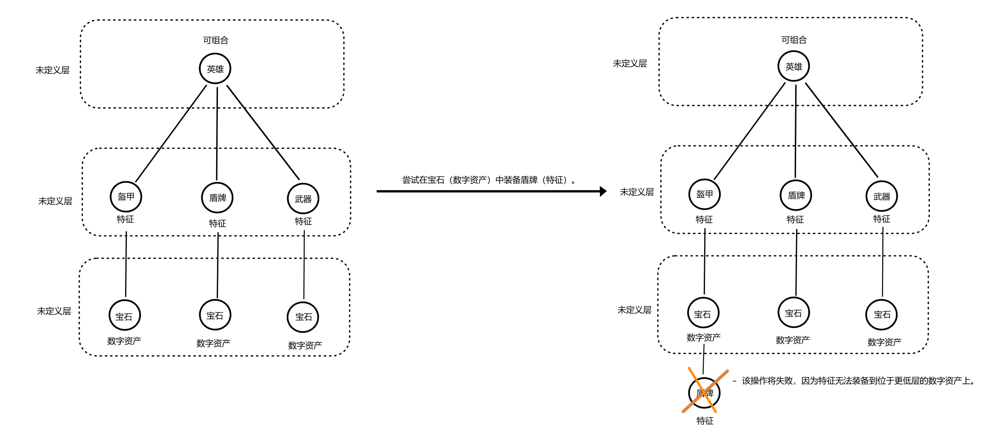

[TOC]

# AIP-76 - 可组合数字资产标准

## 一、摘要

本 AIP 提出一个特定目的的、可扩展的组合性框架，允许创作者为动态个人资料图片（PFP）、可组合的游戏资产以及其他需要组合性的丰富应用创建 NFT。它通过基于`AIP-11`和`AIP-10`的对象模型引入新的业务逻辑、子功能、数据结构和API，同时利用`AIP-22`的无代码特性以及`AIP-21`中与可替代资产的组合性自由。 

该解决方案不仅解决了这一方面的问题，还引入了如创作者管理、自定义元数据和嵌入式迁移等补充功能。此外，框架还包括了`AIP-44`中的事件发射功能，从而为可组合 token 用例提供了一个全面的堆栈。


## 二、动机

该解决方案建议了一种分层的数字资产组合方式。在这个提案中，一个 NFT 或 token 可以拥有自己的 token  collection ，而这些 token 中的每一个又可以拥有自己的 token  collection ，形成一个单向路径。这种有意的设计对于强制执行在不同层级上相同类型 token 的特定和指定的组合方式至关重要。

例如，考虑一个拥有剑 token 的玩家 token，而剑 token 又拥有一个力量 token 。该解决方案强制执行严格的组合层级，确保剑 token 只能与玩家 token 组合，而力量 token 只能与剑 token 或玩家 token 组合。

层级结构由三个层次组成：

- `可组合`（Composable）：一个封装`token-object`的包装器，作为根并可以包含特征、数字资产和可替代资产。
- `特征`（Trait）：一个封装`token-object`的包装器，作为可组合的子代，能够持有数字资产和可替代资产。
- `DA`（数字资产）：一个封装`token-object`的包装器，代表树的叶子并作为特征的子代。它可以持有可替代资产，并允许在层级中进一步扩展。


> ℹ️ 图1：*包装器示意图*

该解决方案还嵌入了组合性机制，这涉及到将意图用于组合的 token 转移到目标 token 以进行组合。这一动作冻结了前者转移的能力，并最终更新了后者的uri。


## 三、基本原理

可组合性是在 `AIP-10` 中引入的，它允许对象拥有其他对象。然而，它并没有专门设计用于促进分层组合，这是一个在PFP NFT的NFT特征关系以及游戏资产的角色-物品关系中广泛存在的特性。这种分层组合的缺失意味着对象可以拥有其他对象，而没有结构化的路径来清晰地定义哪些对象应该拥有其他对象，哪些对象不应该拥有，这可能导致从外在 collection 对象中资产的潜在破坏。

在 token 领域，愿意实施可组合 NFT 或 cNFT 的创建者将不得不为一个定义好的路径的可组合性机制编写代码。对于一些人来说，这可能不是问题，但有些事项需要考虑：

- 可扩展性支持：解决方案应支持在创建后添加新资源，提供向 token 添加额外资源的灵活性。这有助于通过资源自定义元数据。
- cNFT 数据结构：该结构需要一个清晰的组合路径，因此不是所有的 token 都可以相互组合。所以，需要一个数据结构来强制执行这一点。
- 数据可访问性：cNFT 需要能够访问它们拥有的 token 以及所拥有的 token 的数据。这是为了确保与父 token 处于组合关系的 token 的元数据被存储、可访问，并且应该禁用其转移能力，以不违反组合规则。
- 更新 `uri`：父 token 的 `uri` 应该更新以反映子 token 的组合。这是为了确保父 token  `uri` 反映了它拥有的子 token ，而组合结构内的任何变化都应该反映出来。

### 1. 现有解决方案

#### 1.1 AIP-22

`aptos-token` 在 `AIP-22` 中引入，旨在允许开发人员创建 token 和 collection 而无需编写任何 Move 代码。它做出关于业务逻辑、数据布局的决策，并提供入口函数。它还支持创作者管理、使用 `PropertyMap` 的自定义元数据和可组合性。但它也存在一些限制：

- 没有可扩展性支持：`AptosToken` 数据结构缺少对 `ExtendRef` 的存储，在创建后它返回 `Object<AptosToken>` 而不是 `ConstructorRef`，这导致无法在创建后添加新资源。
- 没有组合性结构：`aptos-token` 不强制执行清晰的组合路径，允许任何 `AptosToken` 与任何 `AptosToken` 组合。这可能会导致不需要的资产损坏，就像前面提到的外部 collection 对象一样。
- 没有数据可访问性：`aptos-token` 不提供一种方式让 token 访问它们拥有的 token 的数据，以及拥有的 token 内部的 token。
- 更新 `uri` 的权限：在 `aptos-token` 中，token 的 `uri` 可以在某些情况下由创建者更新（如果 `mutable_token_uri = true`），或者它可以永远保持相同的 `uri`（如果 `mutable_token_uri = false`）。这是在 collection 创建时设置的，创建后无法更新。手动更新 token 的 `uri` 可能会带来潜在的安全风险，因为它可能被用来错误地声称拥有不同的数字资产。

下面是使用 `aptos-token` 的 `hero.move` 的可视化示例：


> ℹ️ 图2：*使用 `AIP-22` 的 hero.move*

#### AIP-21

在 `AIP-21` 中引入的通用资产相比传统的硬币标准带来了更灵活和更富表现力的特性。它使得一个对象可以由许多不同但可以互换的所有权单位来表示。然而，这一改进并没有解决数字资产组合中的分层结构的需求。此外，虽然允许任何 `FungibleAsset` 与任何其他 `FungibleAsset` 结合，虽然在组合方面提供了很大的自由度，但它并没有为潜在的需要更多结构化组合设置的用例提供组合的有向路径。

---
本 AIP 考虑了这些先前 AIP 所提出的特性，特别是：

- 在 `AIP-21` 中实现的可组合性支持通用资产的自由度。
- 在 `AIP-22` 中实现的数字资产无代码解决方案为创作者提供的便利性。这个新的 AIP 打算利用这些特性来建立一个新的可组合性框架，同时为用户提供基于Move 对象提出的资产组合的有向路径。

这项新的AIP意在利用这些功能，提出一个新的可组合性框架，同时为用户提供基于`AIP-10`中提出的Move对象进行资产组合的指导方式。


在`AIP-21`中引入可替代资产与传统的 Coin 标准相比，提供了更多的灵活性和表现力。它允许一个对象由许多不同的、可互换的所有权单位表示。然而，这种改进并没有解决数字资产组合中需要层级结构的需求。此外，通过允许任何`FungibleAsset`与任何其他`FungibleAsset`组合，尽管在组合方面提供了很大的自由度，但它并没有为潜在用例（如PFP和游戏资产）提供一个组合的定向路径，这些用例可能需要在其组合性设置中更多的结构。

本AIP考虑了这些先前 AIP 提出的特性： 

- `AIP-21`中实例化的可替代资产的组合自由。
- `AIP-22`中为创作者提供的数字资产无代码解决方案的便利性。这个新的 AIP 旨在利用这些特性，在一个新的组合性框架中，同时提供基于`AIP-10`中提出的 Move 对象的用户参与资产组合的定向方式。


## 四、规范

### 1. 概述

#### 可扩展性支持

#### 1.1 组合性数据结构

为了向创作者和开发者提供如动态个人资料图片（Dynamic PFP）、游戏资产等应用的明确路径，该解决方案引入了一个分层的数字资产组合设置，它由三个层次组成：

- 第1层：*可组合*（Composable）- 一个 token 包装器，存储它所持有的特征、数字资产和可替代资产的列表。
- 第2层：*特征*（Trait）- 一个作为可组合性元数据的包装器，存储它所持有的数字和可替代资产的列表。
- 第3层：*DA* - 一个作为特征和可组合性元数据的包装器，存储它所持有的可替代资产的列表。

这个分层设置主要使用`AIP-10`和`AIP-11`实现，并基于树状结构设计，其中可组合是根，特征是可组合的子代，DA是特征的子代。树的深度默认设置为三层，但可以扩展到任何级别。此外，树可以有多个分支。

总体而言，可视化表示如下所示：


> ℹ️ 图 3：*数字资产组合的分层设置*

#### 1.2数据可访问性

该解决方案允许 token 访问它们所拥有的 token 的数据，以及它们所拥有的 token 所拥有的token的数据。这是为了确保与父 token 有组合关系的 token 的元数据被存储并可访问。

[有关更多详细信息，请参阅数据结构部分。](###数据结构)

#### 1.3更新 `uri`

父 token 的 `uri` 将更新以反映子 token 的组合。这是为了确保父 token  `uri` 反映其拥有的子 token ，同时任何组合结构内的变化都应该被反映出来。

该解决方案支持使用 `AIP-11` 中引入的 `ExtendRef` 能力在创建后添加新资源，从而灵活地为 token 添加额外资源。这有助于通过资源自定义元数据。然后，`property_map`可以用来存储 token 的静态元数据，资源可以用来存储 token 的动态元数据。例如：`property_map` 可以存储剑的类型：“木制”，资源可以存储剑的力量：“100”。
此外，框架层次结构的多层结构在其第三层中包括对 `DA` 的支持，允许所有 `aptos-token` 和开发者向框架添加更多层次。




> ℹ️ 图 4：*使用提议标准的 hero.move*

#### 1.4数字资产中的可互换资产

该解决方案通过 `AIP-21` 中的 `primary_fungible_store` 引入可互换资产到组合性框架中，其中任何 token （不考虑其层次）都拥有一个 `PrimaryStore`。这意味着 token 可以持有可互换资产，为涉及 token 拥有可互换资产的应用程序提供了实用性，例如游戏中的货币、食物、宝石等。

想象一种场景，英雄令牌拥有背包 token ，可以存储一定数量的食物。在这里，食物是游戏环境中可访问的可互换资产。该过程包括使用 `PrimaryStore` 将食物转移给背包 token ，随后，背包 token 可以转移给另一个英雄 token 。

此外，如果需要，提议的cNFT结构可以扩展以包含一个`SecondaryStore`，以适应更复杂的用例。


### 2. 可组合性生命周期

假设一个 collection 已经创建，并且创建了具有不同三个子类型的 token 。

- 将特征 token 组合到可组合 token 中：
  1. 实体调用 `equip` 函数。
  2. 使用 `AIP-10` 中的 `transfer()` 将特征 token 转移到可组合 token 。
  3. 禁用特征 token 的转移功能（使用 `AIP-11` 中的 `disable_ungated_transfer()`）。
  4. 将特征对象复制到可组合 token 的特征列表中。
  5. 更新可组合 token 的 URI。
  6. 使用 `AIP-44` 发出事件。

- 从可组合 token 中分解特征 token ：
  1. 实体调用 `unequip` 函数。
  2. 从可组合token 的特征列表中移除特征对象。
  3. 启用特征 token 的转移功能（使用 `AIP-11` 中的 `enable_ungated_transfer()`）。
  4. 使用 `AIP-10` 中的 `transfer()` 将特征 token 转移回拥有者。
  5. 更新可组合 token 的 URI。
  6. 使用 `AIP-44` 发出事件。

DA 和可组合 token 也适用相同的步骤。

### 3. 核心逻辑

核心逻辑包括组合机制、collection、token 及其管理。

#### 3.1 collection

collection 可以有符号，并支持供应量跟踪。

#### 3.2 token

有三种子类型的 token ，它们将作为整体 token 结构的层级。

每个 token 的引用将包装在主包装器中，以便成功地进行 token 组合而不违反合约规则。

##### 3.2.1 DA（Digital Assets）

数字资产是对象 token 标准的本地 token 。目前，数字资产可以持有可替代资产。

##### 3.2.2 特征（Traits）

特征可以持有数字资产和可替代资产的列表。

##### 3.2.3 可组合（Composables）

可组合可以持有特征列表、数字资产列表和可替代资产。

#### 3.3 组合

组合和分解的机制嵌入在模块中，因此创建者无需担心编写代码。

组合将涉及将 token 转移到要组合的 token ，禁用其转移功能，以避免违反组合规则，并最终更新要组合到的 token 的 `uri`。

#### 3.4 示例

一个创作者正在创建一个具有可组合特征的游戏 NFT collection。
这个 AIP 将允许定义如下的特征：

- 可组合 - 骑士。
- 特征 - 基本剑。
- DA - 治疗乳液。


> ℹ️ 图5：*可组合特征示例*

### 4. 数据结构

该标准为 token 子类型和 collection 指定了数据结构。

####  4.1 collection 数据结构

```move
#[resource_group_member(group = aptos_framework::object::ObjectGroup)]
    // 用于 collection 的存储状态
    struct Collection has key {
        //  collection 名称
        name: String,
        //  collection 符号
        symbol: String,
        //  collection 的供应类型；可以是固定、无限或并发
        supply_type: String,
        // 用于变异 collection 字段
        mutator_ref: Option<collection::MutatorRef>,
        // 用于变异版税
        royalty_mutator_ref: Option<royalty::MutatorRef>,
        // 确定创建者是否可以变异 collection 的描述
        mutable_description: bool,
        // 确定创建者是否可以变异 collection 的 URI
        mutable_uri: bool,
        // 确定创建者是否可以变异 token 描述
        mutable_token_description: bool,
        // 确定创建者是否可以变异 token 名称
        mutable_token_name: bool,
        // 确定创建者是否可以变异 token 属性
        mutable_token_properties: bool,
        // 确定创建者是否可以变异 token  URI
        mutable_token_uri: bool,
        // 确定创建者是否可以销毁 token 
        tokens_burnable_by_creator: bool,
        // 确定创建者是否可以冻结 token 
        tokens_freezable_by_creator: bool
    }
```

#### 4.2 DA 数据结构

```move
#[resource_group_member(group = aptos_framework::object::ObjectGroup)]
// 用于数字资产的存储状态
struct DA has key {
    parent: Option<address>, // 如果已装备，则为父 token 的地址
    index: u64, // 在可组合或特征中的 digital_assets 向量中的 DA 的索引
}
```

#### 4.3 特征数据结构

```move
#[resource_group_member(group = aptos_framework::object::ObjectGroup)]
// 用于特征的存储状态
struct Trait has key {
    parent: Option<address>, // 如果已装备，则为父 token 的地址
    index: u64, // 在可组合中的 traits 向量中的特征的索引
    digital_assets: vector<Object<DA>> // 特征持有的数字资产
}
```

#### 4.4 可组合数据结构

```move
#[resource_group_member(group = aptos_framework::object::ObjectGroup)]
// 可组合的存储状态；也称为 token 的原子/主体
struct Composable has key {
    traits: vector<Object<Trait>>,
    digital_assets: vector<Object<DA>>
}
```

#### 4.5 通用 token 子类型数据结构

```move
#[resource_group_member(group = aptos_framework::object::ObjectGroup)]
    //  token 引用的存储状态，粘贴到 token 对象上
    struct References has key {
        burn_ref: Option<token::BurnRef>, // 销毁引用
        extend_ref: object::ExtendRef, // 扩展引用
        mutator_ref: Option<token::MutatorRef>, // 变异引用
        transfer_ref: object::TransferRef, // 转移引用
        property_mutator_ref: property_map::MutatorRef // 属性变异引用
    }
```

#### 4.6 其他数据结构

```move
// 用于确定 token 的命名风格
struct Indexed has key {}
struct Named has key {}

// 用于确定流程类型
struct Equip has key {}
struct Unequip has key {}
```

### 5. API

标准包含了所有可用于访问、转移、组合、变异、删除 token 以及管理 collection 和版税的 API。由于可组合性标准将此留给更具体的实现，因此没有入口函数。

#### 5.1  collection  API

```move
// 创建一个 collection ；这将创建一个 collection 资源、一个 collection 对象，并返回 collection 的构造引用。
public fun create_collection<SupplyType: key>(
    signer_ref: &signer,
    description: String,
    max_supply: Option<u64>, // 如果 collection 设置为有固定供应量，则为可选
    name: String,
    symbol: String,
    uri: String,   
    mutable_description: bool,
    mutable_royalty: bool,
    mutable_uri: bool,
    mutable_token_description: bool,
    mutable_token_name: bool,
    mutable_token_properties: bool,
    mutable_token_uri: bool,
    tokens_burnable_by_creator: bool,
    tokens_freezable_by_creator: bool,
    royalty_numerator: Option<u64>,
    royalty_denominator: Option<u64>
): object::ConstructorRef
```

```move
public fun is_mutable_collection_description<T: key>(collection: Object<T>): bool
```

```move
public fun is_mutable_collection_royalty<T: key>(collection: Object<T>): bool
```

```move
public fun is_mutable_collection_uri<T: key>(collection: Object<T>): bool
```

```move
public fun is_mutable_collection_token_description<T: key>(collection: Object<T>): bool
```

```move
public fun is_mutable_collection_token_name<T: key>(collection: Object<T>): bool
```

```move
public fun is_mutable_collection_token_uri<T: key>(collection: Object<T>): bool
```

```move
public fun is_mutable_collection_token_properties<T: key>(collection: Object<T>): bool
```

```move
public fun are_collection_tokens_burnable<T: key>(collection: Object<T>): bool
```

```move
public fun are_collection_tokens_freezable<T: key>(collection: Object<T>): bool
```

```move
public fun get_collection_name(collection_object: Object<Collection>): String
```

```move
public fun get_collection_symbol(collection_object: Object<Collection>): String
```

```move
public fun get_collection_supply_type(collection_object: Object<Collection>): String
```

####  5.2 token  API

该部分包含了无论什么 token 类型（无论是可组合、特性还是数字资产）都适用的 API。

```move
// 根据类型创建 token 。可以是特性或可组合 token ；
// 这将创建一个 token 资源、一个 token 对象，
// 并返回 token 的构造引用。
public fun create_token<Type: key, NamingStyle: key>(
    signer_ref: &signer,
    collection: String,
    description: String,
    name: String,
    name_with_index_prefix: String,
    name_with_index_suffix: String,
    uri: String,
    royalty_numerator: Option<u64>,
    royalty_denominator: Option<u64>,
    property_keys: vector<String>,
    property_types: vector<String>,
    property_values: vector<vector<u8>>
): object::ConstructorRef
```

```move
// 将数字资产组合到可组合 token 
public fun equip_digital_asset(
    signer_ref: &signer,
    composable_object: Object<Composable>,
    da_object: Object<DA>,
    new_uri: String
)
```

```move
// 组合 FA；将 FA 转移到 token ； token 可以是可组合或特性
public fun equip_fa_to_token<FA: key, Token: key>(
    signer_ref: &signer,
    fa: Object<FA>,
    token_obj: Object<Token>,
    amount: u64
)
```

```move
// 取消组合 FA；从 token 转移到所有者
public fun unequip_fa_from_token<FA: key, Token: key>(
    signer_ref: &signer,
    fa: Object<FA>,
    token_obj: Object<Token>,
    amount: u64
)
```

```move
// 转移数字资产；从用户到用户。
public fun transfer_token<Token: key>(
    signer_ref: &signer,
    token_addr: address,
    new_owner: address
)
```

```move
// 将 FA 从用户转移到用户。
public fun transfer_fa<FA: key>(
    signer_ref: &signer,
    recipient: address,
    fa: Object<FA>,
    amount: u64
)
```

```move
// 销毁 token 
public fun burn_token<Type: key>(owner: &signer, token: Object<Type>)
```

```move
// 冻结 token 转移功能
public fun freeze_transfer<T: key>(creator: &signer, token: Object<T>)
```

```move
// 解除 token 转移功能冻结
public fun unfreeze_transfer<T: key>(creator: &signer, token: Object<T>)
```

```move
// 设置描述
public fun set_description<T: key>(creator: &signer, token: Object<T>, description: String)
```

```move
// 设置名称
public fun set_name<T: key>(creator: &signer, token: Object<T>, name: String)
```

```move
// 设置特性 URI
public fun set_trait_uri(owner: &signer, trait_obj: Object<Trait>, uri: String)
```

```move
// 设置 token 属性
public fun add_property<T: key>(
    owner: &signer,
    token: Object<T>,
    key: String,
    type: String,
    value: vector<u8>
)
```

```move
// 添加类型化的 token 属性
public fun add_typed_property<T: key, V: drop>(
    owner: &signer,
    token: Object<T>,
    key: String,
    value: V,
)
```

```move
// 删除 token 属性
public fun remove_property<T: key>(
    owner: &signer,
    token: Object<T>,
    key: String,
)
```

```move
// 更新 token 属性
public fun update_property<T: key>(
    owner: &signer,
    token: Object<T>,
    key: String,
    value: vector<u8>,
)
```

```move
// 获取父 token 
public fun get_parent_token<T: key>(token: Object<T>): address
```

```move
// 获取索引
public fun get_index<T: key>(token_obj: Object<T>): u64
```

```move
// 检查 token 属性是否可变
public fun are_properties_mutable<T: key>(token: Object<T>): bool
```

```move
// 检查 token 是否可销毁
public fun is_burnable<T: key>(token: Object<T>): bool 
```

```move
// 检查描述是否可变
public fun is_mutable_description<T: key>(token: Object<T>): bool
```

```move
// 检查名称是否可变
public fun is_mutable_name<T: key>(token: Object<T>): bool
```

```move
// 检查 URI 是否可变
public fun is_mutable_uri<T: key>(token: Object<T>): bool
```

```move
// 获取 token 签名者
public fun get_token_signer<T: key>(token: Object<T>): signer
```

#### 5.3 数字资产 (DA) APIs

#### 5.4 特性 (Trait) APIs

```move
// 将数字资产组合到特性
public fun equip_digital_asset_to_trait(
    signer_ref: &signer,
    trait_object: Object<Trait>,
    da_object: Object<DA>,
    new_uri: String
)
```

```move
// 从特性中分解数字资产
public fun unequip_digital_asset_from_trait(
    signer_ref: &signer,
    trait_object: Object<Trait>,
    da_object: Object<DA>,
    new_uri: String
)
```

#### 5.5 可组合 (Composable) APIs

```move
// 将特性组合到可组合 token 
public fun equip_trait(
    signer_ref: &signer,
    composable_object: Object<Composable>,
    trait_object: Object<Trait>,
    new_uri: String
)
```

```move
// 从可组合 token 中分解数字资产
public fun unequip_digital_asset_from_composable(
    signer_ref: &signer,
    composable_object: Object<Composable>,
    da_object: Object<DA>,
    new_uri: String
)
```

```move
// 从可组合 token 中分解特性。测试将会抛出异常。
public fun unequip_trait(
    signer_ref: &signer,
    composable_object: Object<Composable>,
    trait_object: Object<Trait>,
    new_uri: String
)
```

```move
// 从可组合 token 获取特性
public fun get_traits_from_composable(composable_object: Object<Composable>): vector<Object<Trait>> 
```

## 五、参考实现

- 主要分支：`devnet`
- SDK：需要基于模块的最新版本进行更新

## 六、风险和缺陷

- 如果更新 URI 的操作出现错误，可能会导致欺诈行为。但我认为我们可以通过强制要求在链上生成 URI 来降低这种风险。

- 提议的标准将被添加到现有标准之上，而不会对它们进行任何更改。这意味着提议的标准不会破坏任何现有功能。

- 尽管在 AIP 讨论的早期阶段提到了可扩展性问题，但我们已经在框架层次结构中包含了 `DA` 的支持，以允许在 `Composable` 和 `Trait` 之间的关系定义之外进行扩展。


## 七、未来潜力

在游戏、票务和房地产等行业中，加入可组合特性的数字资产标准能带来革命性的改变。

具备可组合性的数字资产，在游戏中可以创造出独一无二的角色，在票务方面可以实现流程的高效简化，在房地产中则可以轻松实现分摊所有权。这些创新的可能性为创作者在不同行业中提供了具备潜力的新型解决方案。


## 八、建议的实施时间表

- 探索版本自 2024 年 1 月起已在 `TowneSpace-contract/examples` 的 **`devnet`** 分支中存在。

假设 AIP 通过了审查者的设计审查。

...

- 在 devnet 上：2024 年 2 月
- 在测试网上：2024 年 3 月
- 在主网上：2024 年 3 月底
