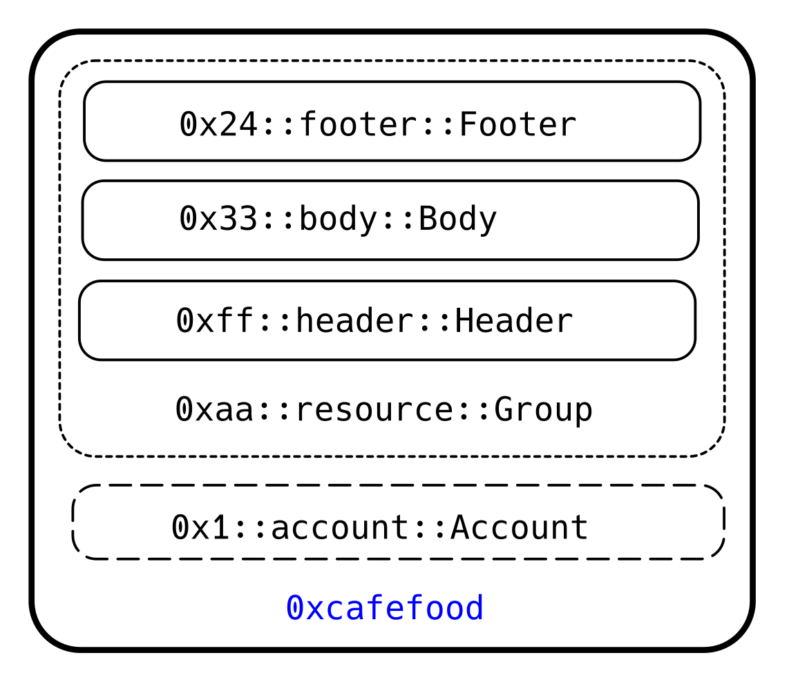

[TOC]

# AIP-9 - 资源组

## 一、概述

本 AIP 提议资源组（resource group）支持将多个不同的 Move 资源一起存储到单个存储插槽中（a single storage slot）。


## 二、动机

在开发进程中，通常会有为一个资源（resource）添加新字段（field）或支持可选的（optional）、异构的资源集（heterogeneous set of resources）的需求。但是一旦资源（resource）或结构体（struct）被发布到区块链上，它们就会变成不可更改的。因此，在这种情况下，添加新字段的唯一方法就是创建一个全新的资源。

在 Aptos 中，每一个不同的资源都对应一个存储槽位。每一个存储槽位都是默克尔树（Merkle tree）或认证数据结构（authenticated data structure）中的唯一项。在这种认证数据结构中，每一份验证证明都将占用 `32 * LogN`  字节的空间，其中 `N` 代表存储槽位的总数。例如，当 `N = 1,000,000` 时，相应的证明大小是 640 字节。

当启用了 100 万个存储槽位时，哪怕添加一个仅含有事件句柄的新资源，也会占用大约 680 字节空间，其中事件句柄只需要 40 字节。剩余的 640 字节是由于验证体系所需的认证数据证明，这部分证明的数据量通常远大于需要认证的数据本身。除了对存储容量的要求外，读写操作还额外引入了与证明验证和证明生成相关的成本。

资源组允许动态地将数据共享到一个存储插槽中，这样即使在创建资源组后也可以添加新的事件，并且无论存储空间中有多少槽数量，其存储与执行的成本都是固定的。这提供了一种便捷的方式来变更（evolve）数据类型并将不同资源的数据聚合（co-locate）到一起。


## 三、基本原理

资源组通过在 Move 源文件中编码属性来指定应该将哪些资源组合成单个存储槽，从而将数据合并到单个存储槽中。资源组的这种设计在 Move 的语义上并无改变，它只影响到了存储结构的布局。


在存储层面，资源组被存储为一个 BCS 编码的 BTreeMap，其中键是一个 BCS 编码的完全限定结构名称（`address::module_name::struct_name`，例如： `0x1::account::Account`），值是与资源相关的 BCS 编码数据。



我们之前提到的数据存储在 `0xcafef00d` 这个地址上。地址 `0xcafef00d` 上有一个 `0x1::account::Account` 类型的资源。同时，还有一个名为 `0xaa::resource::Group` 的资源组，它包含了一系列资源，这些资源同样存储在此地址。资源组的作用是将多个资源逻辑地捆绑在一起。要访问资源组中的某个特定资源，我们需要按照顺序进行操作：首先读取整个资源组的数据，然后再在其中找到并读取我们所需的那个特定资源。

### 替代方案1 —— SimpleMap 中的 Any

我们考虑过的一个替代方案是通过 `any` 模块来在 `SimpleMap` 中存储数据。这种模式可以在不修改 Aptos 核心代码的前提下实现，但它在链上和链下对于开发者及应用的复杂性都带来了一定的不便。它没有内置的缓存机制，这意味着任何数据的读写操作都需要反序列化（将数据结构转换为内存中的对象）或序列化（将对象转换为数据结构）。也就是说，一个包含 3 次写操作的交易，需要进行 3 次反序列化和 3 次序列化。为了解决这个问题，底层框架需要进行实重大且不可忽视的调整。不过，随着 `SmartMap` 的出现，这个方案可能会更具可行性。最后，由于缺乏统一的操作模式，数据的索引服务和应用程序接口（APIs）并不能轻松地访问这些数据。


### 替代方案2 —— 泛型

另一种考虑的方案是使用模板。不过，使用模板时遇到的难题是，在不明确具体模板类型的情况下，数据无法被部分读取。比方说，有一个对象可能是一种 token 。如果它属于资源组，我们可以很容易地单独读取 `Object` 或 `Token` 资源。但如果是在应用了模板的情况下，我们就必须读取 `Object<Token>`。这一限制可以通过对底层架构进行复杂的修改来克服，但这又带来了部分读取 BCS（二进制规范序列化）编码数据时所涉及的潜在风险，这一点在应用程序设计中还未被充分考虑。在 Move 语言中出现的同样问题也将影响那些使用 REST API 的开发者。


### 问题的一般化

上述两种方法之间有无数种组合。总的来说，这些缺点包括：

- 每次读取和/或写入都需要进行反序列化和序列化的高成本。
- 目前对于返回对全局存储空间（global memory）的引用所存在的限制，减少了泛型功能的使用效率，并且使得对对象进行读取和写入时的额外成本增加。
- 标准上的限制导致 API 和索引器使用更复杂。
- 在模型中访问数据时，如果想要使用具备存储功能的结构体（`struct` with `store`），需要考虑到它的限制。拥有 `key` 能力的结构体在属性上更加严格，同时用户会更容易理解其工作方式。比如说，没有 `key` 功能的存储方法可能会使数据随意分散存储，这会导致在全局范围内进行数据搜索和定位时遇到困难。尽管在某些特定的应用中，这种灵活的数据存储可能是有益的。

## 规范

### 在框架内部

资源组由几个不同的资源组成，或者一个具有 `key` 能力的 Move `struct`。

每个资源组由一个共同的 `Move` 结构标识：

```move
#[resource_group(scope = global)]
struct ObjectGroup { }
```

其中，这个 `struct` 本身不包含任何字段，但带有一个称为 `resource_group` 的属性。这个属性 `resource_group` 包含一个名为 `scope` 的参数，它的作用是确定资源组中其他元素所处的具体区域范围：

- `module` ： 只有在同一个模块中定义的资源才能存储在同一个资源组中。
- `address` ： 只有在同一个地址中定义的资源才能存储在同一个资源组中。
- `global` ：对资源的定义没有限制，任何资源都可以存储在同一个资源组中。

使用 `struct` 的原因是

1. 它允许所有组内的资源在编译时验证它们是否在该组内。
2. 它可以构建在已有的存储模型之上，该模型能识别如何对存储于 `StructTag` 的数据进行读写操作。因此，这个变动只会对虚拟机（VM）和负责读写数据的部分造成最小的影响，使得存储系统无需针对此更改进行调整，可以维持原有的方式运行。
3. 只有 `struct` 和 `fun` 可以具有属性，这反过来让我们可以定义附加参数，如 `scope`。

资源组中的每个条目由 `resource_group_member` 属性标识：

```move
#[resource_group_member(group = aptos_framework::object::ObjectGroup)]
struct Object has key {
    guid_creation_num: u64,
}

#[resource_group_member(group = aptos_framework::object::ObjectGroup)]
struct Token has key {
    name: String,
}
```

在编译和发布过程中，将检查这些属性，以确保：

1. `resource_group` 没有能力和字段。
2. 在 `resource_group` 中，定义的 `scope` 只会变得更加开放。具体来说，它可以维持当前的访问权限不变，或者允许更广泛的访问（increase to the next）。
3. 每个资源组内的资源都具有 `resource_group_member` 属性。
4. `group` 参数设置为标记为 `resource_group` 的结构。
5. 在升级期间，现有的 `struct` 不能添加或删除 `resource_group_member`。

每个这些要求的动机是：

1. 这样做是为了确保某个 `resource_group` 的结构体不被滥用于其他的存储目的。尽管这不是一个硬性规定，但其目的在于帮助开发者避免不必要的混淆。
2. 使作用域变得不那么宽松可能导致已部署的 `resource_group_member` 被破坏。
3. 如果不显式标记资源为 `resource_group_member`，则 Move 无法知道它是否在 `resource_group` 内。
4. 正如前文讨论的，这样做的目的是确保对类型的严格检查，同时集中在一个地方定义资源组特性，从而增强代码的整洁性和类型安全。
5. 如果资源内部储存了数据，在这些资源加入（entering）或退出（leaving）资源组的过程中，可能会出现数据无法被访问的情况。

### 在存储中

从存储结构上讲，资源组采用 BCS 编码的形式存储，具体为一个 `BTreeMap<StructTag, BCS encoded MoveValue>` 数据结构，这里的 `StructTag` 是 Move 中已知的结构形式：`{ account: Address, module_name: String, struct_name: String }`。相比之下，一个常规资源则是以 `BCS encoded MoveValue` 的形式进行存储。

资源组创建了一条名为 `ResourceGroup` 的新的存储访问路径，其目的是将其与原有的访问路径明确区分开。这种做法让接口更加清晰，并将不同种类的存储分隔开，这对索引器和其他直接读取存储的程序非常有利，因为它们现在可以解析存储而无需检查模块元数据。拿之前的例子来说，像 `0x1::account::Account` 这样的资源，被存储在了 `AccessPath::Resource(0xcafef00d, 0x1::account::Account)` 的位置，而资源组及其内部内容，则存储在 `AccessPath::ResourceGroup(0xcafef00d, 0xaa::resource::Group)` 的路径下。

确定一个资源是否属于资源组的唯一方法是通过读取与资源关联的模块元数据。在读取模块元数据后，存储客户端应该通过直接读取 `AccessPath::Resource` 或先读取 `AccessPath::ResourceGroup`，然后对 `BTreeMap` 进行反序列化，并提取相应的资源来确定资源的归属。

在写入时，资源组的元素必须通过确定写入操作的结果来适当地更新到资源组中。这会导致少数可能性：

- 存储中不存在资源组，这是一个新的写入操作。
- 资源组已经存在，那么这是一个修改，即使元素对于资源组是新的，或者正在被删除的一个元素。
- 所有元素都已删除，那么这是一个删除操作。

### 在 Gas 计划和虚拟机中

对于 Gas 计划的影响是：

- 从资源组中读取单个资源会导致对资源组中所有的数据收费。
- 将单个资源写入资源组会导致对资源组中所有的数据收费。

### 在接口中

上文中的存储内容讨论了资源和资源组的布局。用户界面接口，例如 REST API，不应暴露给资源组。这完全是 Move 的概念。应避免直接读取资源组。在读取地址处的批量资源时，应将资源组展开并包含在一组资源中。

## 参考实现

[https://github.com/aptos-labs/aptos-core/pull/6040](https://github.com/aptos-labs/aptos-core/pull/6040)

## 风险和缺点

- 这需要对 API 层进行调整，以读取存储在资源组中的资源。
- 对账户上资源的分页读取需要能够处理不同资源和直接可计数资源之间的差异。
- 读取变更集的实体需要了解资源组内的资源是如何存储的。
- 资源组中的每个资源都会增加一个 `StructTag` 的成本（可能远小于 100 字节）。对资源组的访问将为读取操作增加额外的反序列化，并且对于写入操作则需要额外的反序列化和序列化。这比其他方法要便宜，并且仍然比存储成本要便宜得多。当然，开发者可以自由地探索其实现中的差异，因为资源组并不消除单个资源。

这些都不是重大障碍，并且这些将作为资源组实现的一部分加以解决。

## 未来潜力

虽然资源无法无缝地整合到资源组中，但许多常用资源很可能被迁移到资源组中的新资源，以增加升级的灵活性。这是因为资源组不会将开发人员锁定在固定的资源布局中。事实上，这将使 Aptos 回归到支持更符合习惯的 Move 方式，即在同一地址存储资源，从而摆脱了之前阻碍开发者的性能考虑。

另一个值得研究的领域是，根据泛型类型的不同，是否可以将一个模板化的结构放在资源组中。考虑当前的 Aptos `Account` 和 `CoinStore<AptosCoin>`存储方式，将它们分开存储会对性能和存储成本产生负面影响。

在当前的 VM 实现中，资源在读取时会被缓存。这可以通过在读取时缓存整个资源组来改进。

## 建议的实施时间表

- 在 1 月底之前进入开发网络。
- 预计会在 2 月的测试网络版本中发布。
- 理想情况下，应在 3 月份的主网版本发布。

## 参考资料

- [any.move](https://github.com/aptos-labs/aptos-core/blob/main/aptos-move/framework/aptos-stdlib/sources/any.move)
- [simple_map.move](https://github.com/aptos-labs/aptos-core/blob/main/aptos-move/framework/aptos-stdlib/sources/simple_map.move)
- [StructTag](https://github.com/move-language/move/blob/fcb75d8036d81e06bcb6ac102a414590e753579b/language/move-core/types/src/language_storage.rs#L91)
- [Aptos 认证数据结构](https://github.com/aptos-labs/aptos-core/blob/main/documentation/specifications/common/authenticated_data_structures.md)
- [Move 语言手册](https://move-language.github.io/move/)
